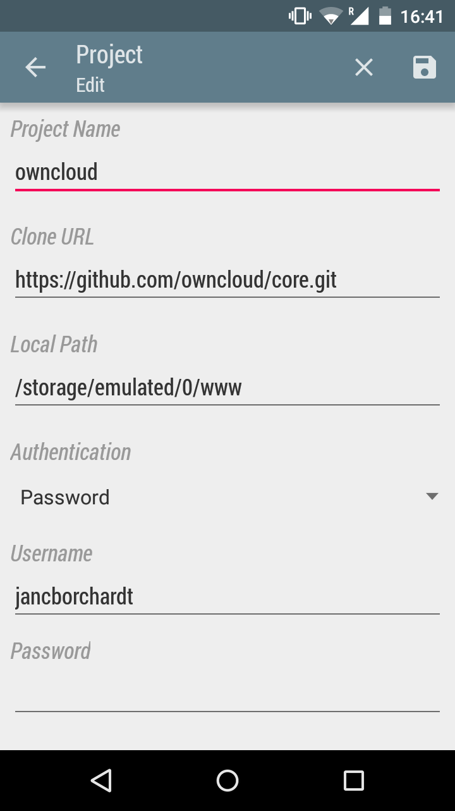
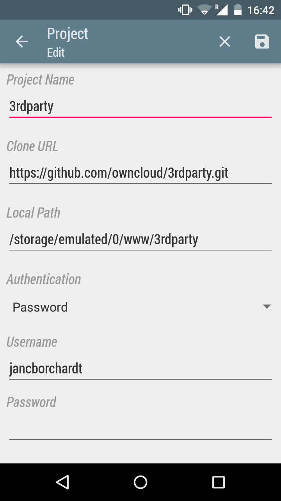
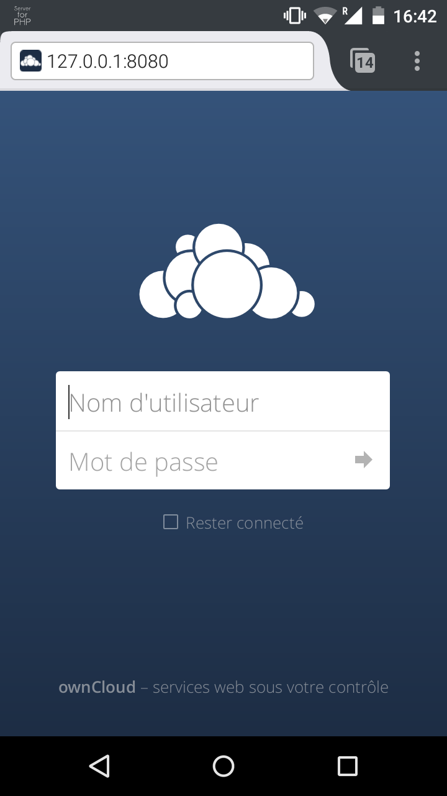

# ownCloud on Android

How to set up a server / development environment.

Apps you need:
- Pocket Git (others like SGit, Agit, Terminal IDE, Git, Gidder, etc. are pretty much unmaintained)
- Server for PHP (others like Palapa, KSWeb, Servers Ultimate etc. are unmaintained)
- optional: DroidEdit (or other text editor of your choice like AWD or Turbo Editor)

Steps to set it up:
1. Clone ownCloud core with Pocket Git using the https git URL to the www folder used by Server for PHP. (/storage/emulated/0/www)

2. Clone ownCloud 3rdparty as well, git submodules are not supported by Pocket Git yet. (/storage/emulated/0/www/3rdparty)

3. Start Server for PHP (Permissions thankfully do not need to be adjusted!)

4. Navigate to the IP to finish setup. Will simply use SQLite as database.

5. Maybe you need to manually add the IP (without the port) to trusted_domains in the config.php
